# Introduction

`gocan` is a little side project heavily inspired from the excellent book [Your Code as a Crime Scene](https://pragprog.com/titles/atcrime/your-code-as-a-crime-scene/) written by Adam Tornhill.

It provides a cli to build some of the charts described in that book and that can be used to start conversations regarding the design or organisation of some application.

It has very similar interface to [code-maat](https://github.com/adamtornhill/code-maat), the tool created by Adam Tornhill. Here are some of the main differences:

- written in golang
- only support git
- use a database to store the information
- include the visualisations

Here is an overview of the visualisations currently available in the tool:

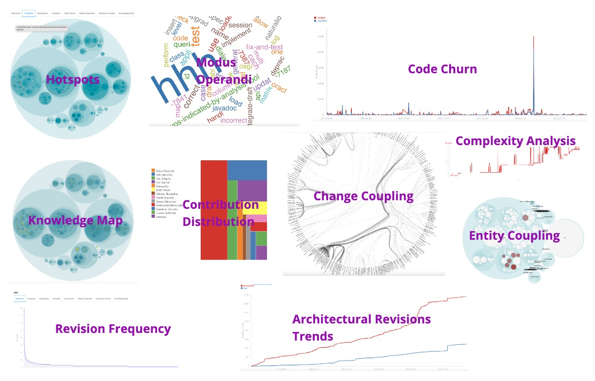

_Note_: to understand the visualisations generated by the tool, it is better to read the book first.

# Installation

For MacOS & Linux users, you can use [homebrew](https://brew.sh) to install the application:

```
brew install fouadh/tap/gocan
```

For other platforms, you will have to build the binary from the source code (see the section below).

There is also a [docker image](https://hub.docker.com/repository/docker/fouadhamdi/gocan) that can be used instead of having to install it locally.

To get the list of available commands:

```
gocan help
```

To get help for a specific command:

```
gocan [command] --help
```

The exhaustive list of commands can be found [here](./doc/commands/gocan.md)

# Using the app

## Start the embedded database

Gocan comes with an embedded database that can be used to store the metrics data. To start it, execute the following
command:

```
gocan start-db
```

## Run the UI

To visualize the different charts, execute the following command that bootstraps an embedded web server:

```
gocan ui
```

## Create a forensics scene

A scene is a collection of applications. Before adding any application, create a scene first. It will allow (not yet
implemented) to compare applications gathered in a same scene. It can be useful to analyze distributed systems for example.

```
gocan create-scene my-scene
```

## Add an application to a scene

Create an application in a scene.

```
gocan create-app my-app -s my-scene
```

## Import an application history

In order to get metrics, it is needed to run this command to import information from a git repository that has been
cloned locally.

```
gocan import-history my-app -s my-scene --after 2021-01-01 --before 2021-06-30
```

It is recommended to limit the data that you want to analyze to a small period. Like mentionned in the book, having
too many data can skew the results and obscure most recent trends.

## Stop the embedded database

When you're done using the CLI, you can eventually stop the database.

```
gocan stop-db
```

## Using an external database

It is possible to use an external database instead of the embedded one. To configure it, use the following command
with the appropriate flags values:

```
gocan setup-db --external-db --host dbhost --user dbuser --password dbpassword --port 5433 --database dbname
```

After configuring the database, execute the next command to create the appropriate structure:

```
gocan migrate-db
```

# A Tutorial

Let's use one of the examples in the book: analyzing Hibernate ORM.

## Creating the scene

We'll first define a scene and an application, then import its git history.

```
gocan create-scene hibernate
gocan create-app orm --scene hibernate
git clone https://github.com/hibernate/hibernate-orm.git
gocan import-history orm --scene hibernate --after 2011-01-01 --before 2013-09-04 --directory ./hibernate-orm
```

**Note:** `gocan` does not store the source code in its database, just the statistics about it.

Let's get a summary of what has been imported:

```
gocan app-summary orm --scene hibernate
```

## Studying the hotspots

We can also run the UI to see some visualisations:

```
gocan ui
```

* Open your browser at the appropriate location (here, it will be http://localhost:1233).
* Select the `hibernate` scene
* Select the `orm` application
* The `Revisions` tab will be displayed: it might take a few seconds to display the chart, be patient :-)

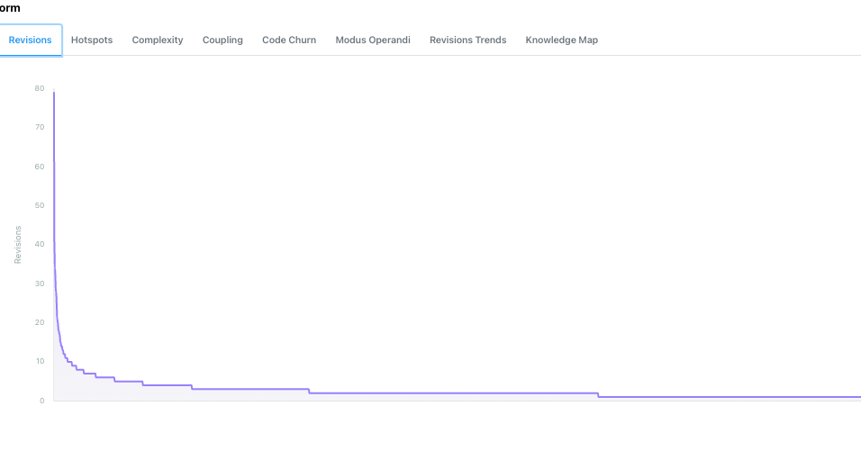

You'll notice that there are some date selectors on the page that can be use to specify the analysis range. Those selectors
are present in most of the analyses tabs.

* Select the `Hotspots` tab to visualize the hotspots of hibernate for the considered period. You can zoom-in in the hierarchy by clicking on
the different zones to find more specifically the files suspects.


* Mine the data with the `revisions` command:

This command displays the application files sorted by number of revisions as well as their complexity (in the `code` column).
It is another way to identify the potential suspects.

```
gocan revisions orm -s hibernate
```

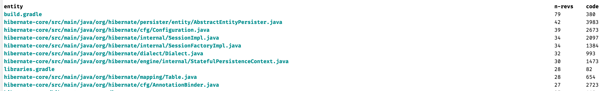

## Focusing on a suspect

We are going to focus on the `Configuration` class that has a big number of lines for a file related to configuration and that also has been revised quite a lot.

Let's analyze the complexity of this file by running the following command:

```
gocan create-complexity-analysis configuration-analysis --app orm --scene hibernate --directory /code/hibernate-orm/ --filename hibernate-core/src/main/java/org/hibernate/cfg/Configuration.java --spaces 4 
```

The `directory` argument specifies the local folder where the git repo can be found and the `filename` argument specified the location of the file to analyze relative to that directory.

The command will return the complexity calculated of that file for the specified time period.

**Note:** to execute that command, you will need to have access to the source code again.

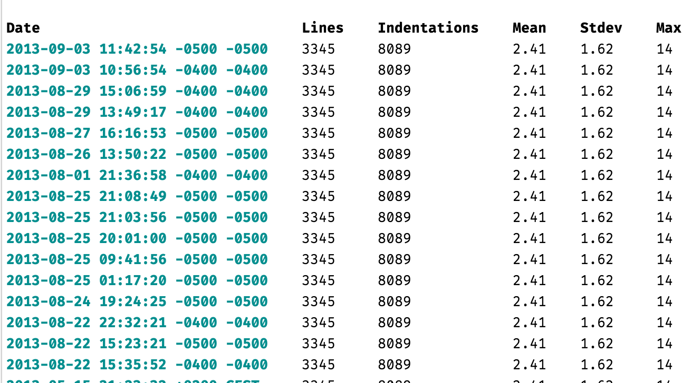

We can see here that there is a maximum number of 14 indentations in some line(s) which might indicated some complicated code there.

Now, if you go to the `Complexity` tab in the UI, you should be able to select the analysis we have just created and named `configuration-analysis`.

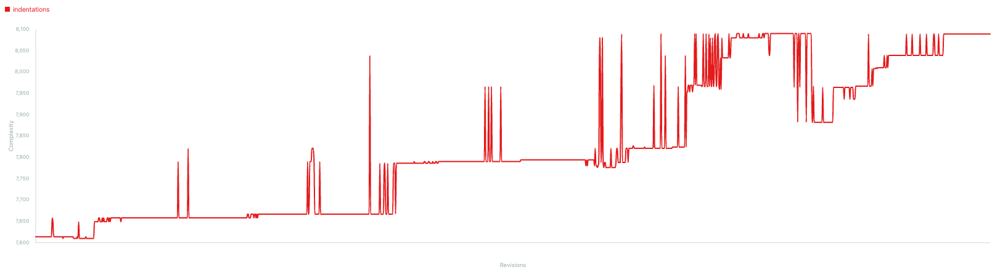

We can see how the complexity increased with time for the analyzed file.

## Analyzing the modus operandi

It is possible to get a list of the most used words in the commit messages.

Either from the terminal with the command:

```
gocan modus-operandi orm --scene hibernate | head -n 10
```

Either from the ui:

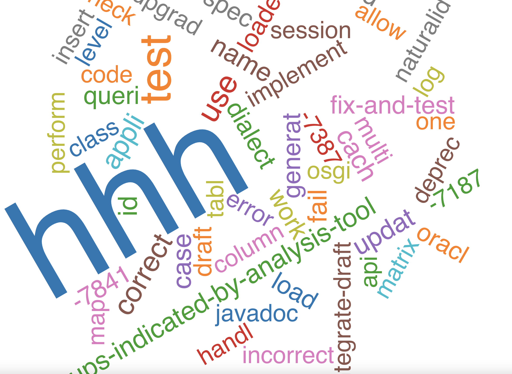

## Looking for relationships between authors and entities

Let's identify the files modified by multiple programmers:

```
gocan revisions-authors orm --scene hibernate --csv | head -n 10
```

```
entity,n-authors,n-revs
hibernate-core/src/main/java/org/hibernate/persister/entity/AbstractEntityPersister.java,13,42
libraries.gradle,11,28
hibernate-core/src/main/java/org/hibernate/loader/Loader.java,10,23
hibernate-core/src/main/java/org/hibernate/internal/SessionImpl.java,9,34
hibernate-core/src/main/java/org/hibernate/mapping/Table.java,9,28
hibernate-core/src/main/java/org/hibernate/cfg/Configuration.java,8,39
build.gradle,8,79
hibernate-core/src/main/java/org/hibernate/cfg/HbmBinder.java,8,20
hibernate-core/src/main/java/org/hibernate/cfg/annotations/CollectionBinder.java,7,21
```

Notice how we used the `--csv` flag that time in order to get the results in csv format. This flag is
available for almost all the commands that return list of data.

We notice here that `AbstractEntityPersister` has been modified by a lot of programmers. Let see the impact on the communication between developers (if you looked carefully at the visualisation, you might have noticed that this file was also a hotspot)

## Identify the files that are coupled with AbstractEntityPersister

```
gocan coupling orm --scene hibernate --min-revisions-average 20 | grep AbstractEntityPersister
```

We find that the three following classes are often commited with `AbstractEntityPersister`:

* `CustomPersister`
* `EntityPersister`
* `GoofyPersisterClassProvider`

## Identify the main-developers

Let's try to find out who are the main developers of each of these files:

```
gocan main-devs orm --scene hibernate | grep AbstractEntityPersister
gocan main-devs orm --scene hibernate | grep CustomPersister
gocan main-devs orm --scene hibernate | grep entity/EntityPersister
gocan main-devs orm --scene hibernate | grep GoofyPersisterClassProvider
```

The results of those commands show that `Steve Ebersole` is the main developer for each of these files: it looks like there should be no communication issue if he modifies `AbstractEntityPersister`.

But if we check for the individual contributions of the `EntityPersister` class:

```
gocan main-devs orm --scene hibernate | grep entity/EntityPersister
```

We'll see that a same author is using two different aliases: `Eric Dalquist` and `edalquist` making the calculation of the main developer wrong for that file.

Let's fix that by renaming the author in the database:

```
gocan rename-dev --app orm --scene hibernate --current edalquist --new "Eric Dalquist"
```

(this command can also be useful to anonymize the data)

If we execute again the command to get the main developer of `EntityPersister`:

```
gocan main-devs orm --scene hibernate | grep entity/EntityPersister
```

We see now that the main developer of this class is `Eric Dalquist`.

The conclusion is that `Steve Ebersole` would probably have to notify `Eric Dalquist` of any modification on `AbstractEntityPersister` since the two classes are coupled.

## Look into the individual contributions with fractal figures

It is possible to visualize the contributions of each developer on a file with fractal figures, each rectangle being proportional to the developer contribution:

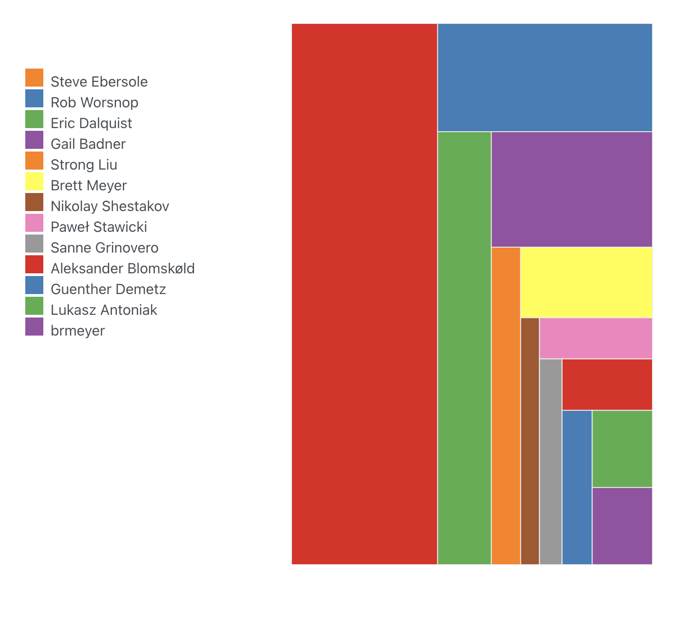

## Get a global view on the knowledge distribution

It is possible to visualize a knowledge map of the main developers of all the entities:

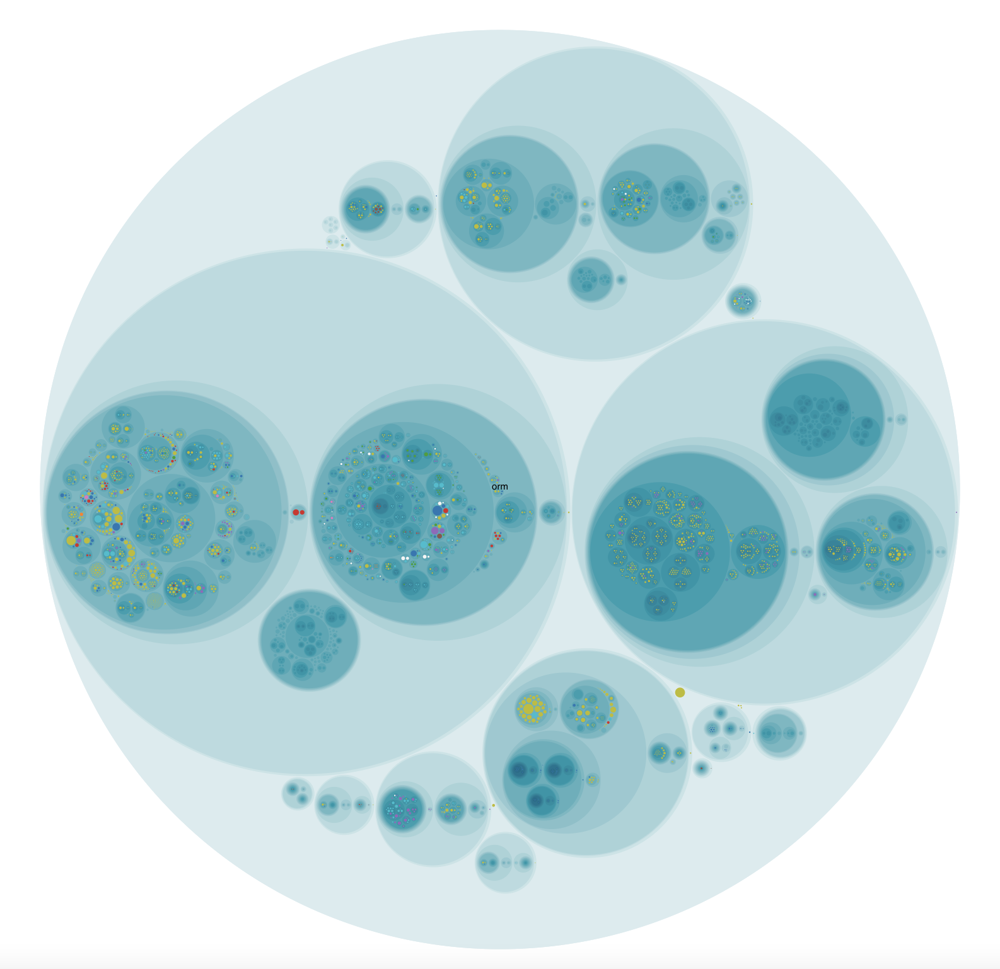

## Study the code churn

It is possible to get information about the churn either from the terminal:

```
gocan  code-churn orm --scene hibernate
```

or in the UI:

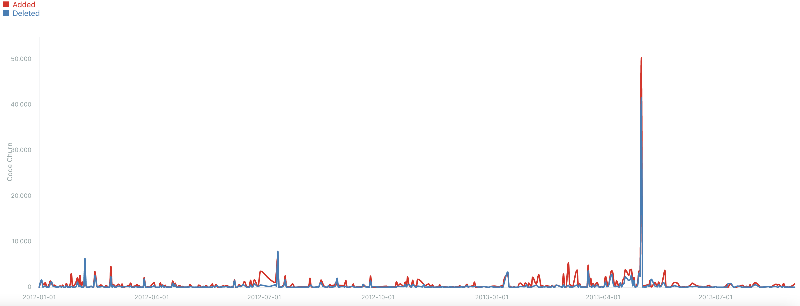

## Coupling visualisation

There is a coupling diagram that visualises the relationships between files: it can be a bit hard to read for large projects though
(still trying to figure out how to make it better, any idea is welcome :-))

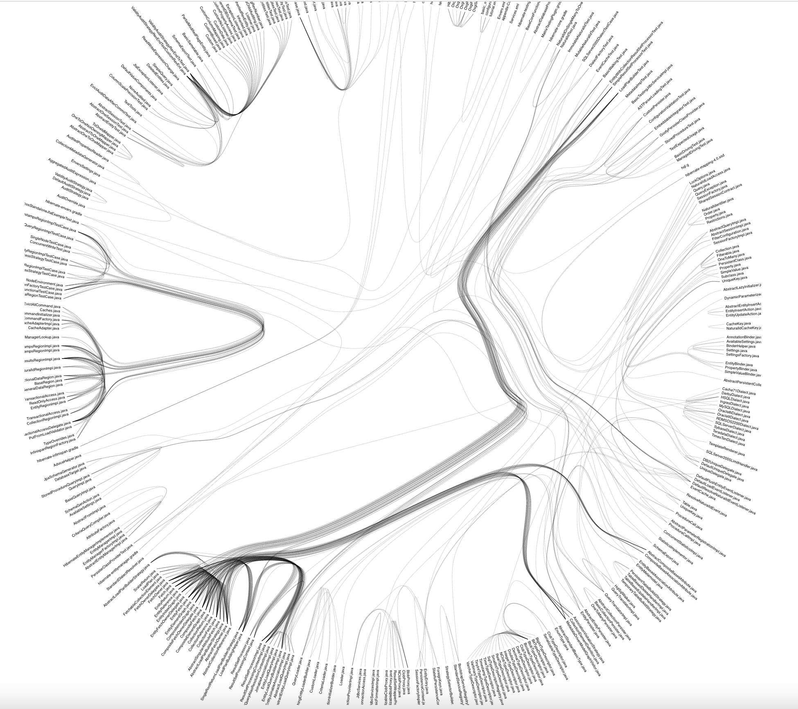

## Entity Coupling

There is a visualisation that allows to see the entities (ie files) coupled with a given file in the UI.

Here are for example the visualisations for one file in two different periods (example coming from the [Craft.Net](./samples/craft.sh) data):

* Period 1:

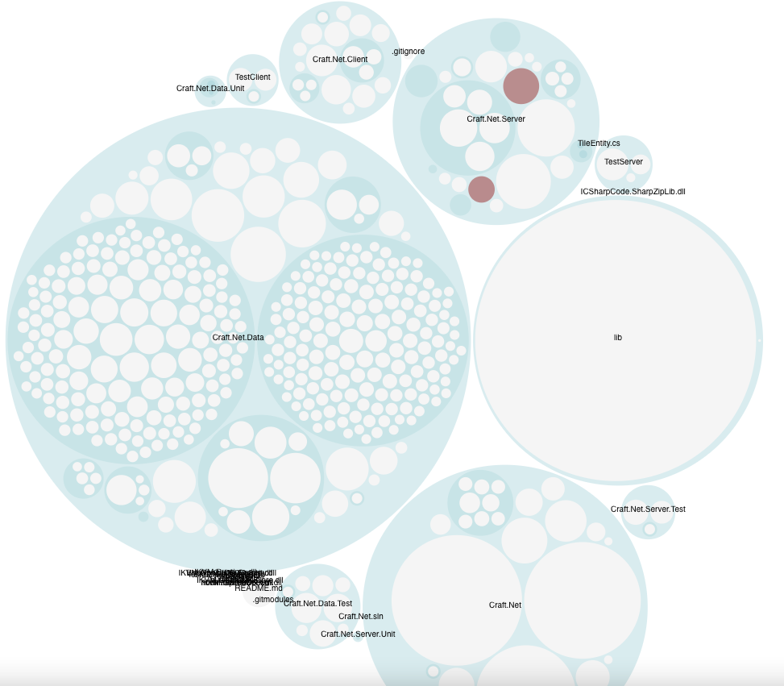

* Period 2:

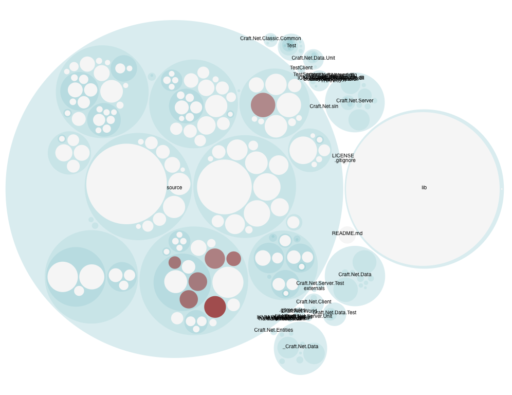

## Revision Trends

It is also possible to visualise the evolution of architecture boundaries.

The first step for that is to create some. For example, let say that we want to compare the evolution of the tests vs the
production code of the `hibernate-core` module, we can create boundaries that define them with the following command:

```
gocan create-boundaries core_production_vs_test --scene hibernate --app orm \
                        --transformation production:hibernate-core/src/main \
                        --transformation test:hibernate-core/src/test 
```

The second step is to calculate the revision trends for a given timespan. Let say that we want to run it over all the
history that has been imported:

```
gocan create-revisions-trends core_src_test --scene hibernate --app maat --boundary core_production_vs_test
```

It might take a moment...

The third step is to visualize the results in the UI:

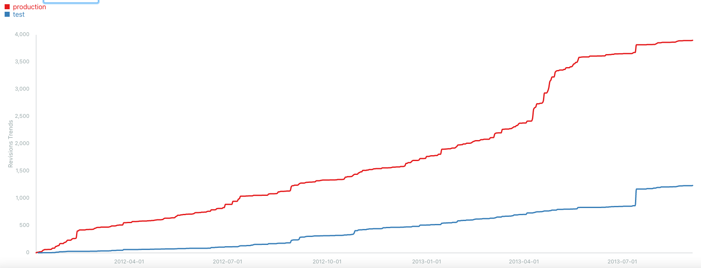

Notice how the test and production code smoothly evolve in parallel until April 2013 when the gap starts to increase
very fast. This is an example of pattern that this visualisation can help to detect. 

**Note**: there is some work in progress to improve the performance of step 2 and, ideally, to get rid of it. Until
then, we have to rely on it to avoid to overstress the backend server.

## Create a storyboard

To visualise the system evolution over time, `gocan` offers the possibility to create videos of some analyses.

For example, to get an evolution of the hotspots:

```
gocan storyboard orm --scene hibernate --after 2012-01-01 --before 2013-09-04 --filename storyboard.avi --interval 14 --analysis hotspots --fps 8 
```


# Want More samples ?

Take a look at the [samples](./samples) folder that contains examples of analyses similar to those
described in the book.

# Building the app

## Requirements

* golang 1.17
* nodejs
* yarn

## Build

Build a version of gocan. The binary will be generated in the `bin` folder.

```
make build
```

## Test

Run all the tests of the project.

```
make test
```

## Release

Build a release version of gocan for MacOS & Linux OSes.

```
make release
```

gocan was an opportunity for me to learn the Go language so don't be too harsh with the source code :-)

# Troubleshooting

## Stopping the database

You might have some issue with the database when trying to start it after having being stopped.

You would get a message similar to that one:

```
Starting the embedded database...

FAILED
Cannot start the database: process already listening on port 5432
```

For some reason, stopping the database didn't work well, you will have to manually kill it
first and start it after.

The MacOS command to retrieve the process to kill is:

```
lsof -i tcp:5432
```


## Fail to import the history

If for some reason, the history import failed and when you run the command again, it complains
about some database key issue, the simplest action to do is to delete the application and
reimport the history.