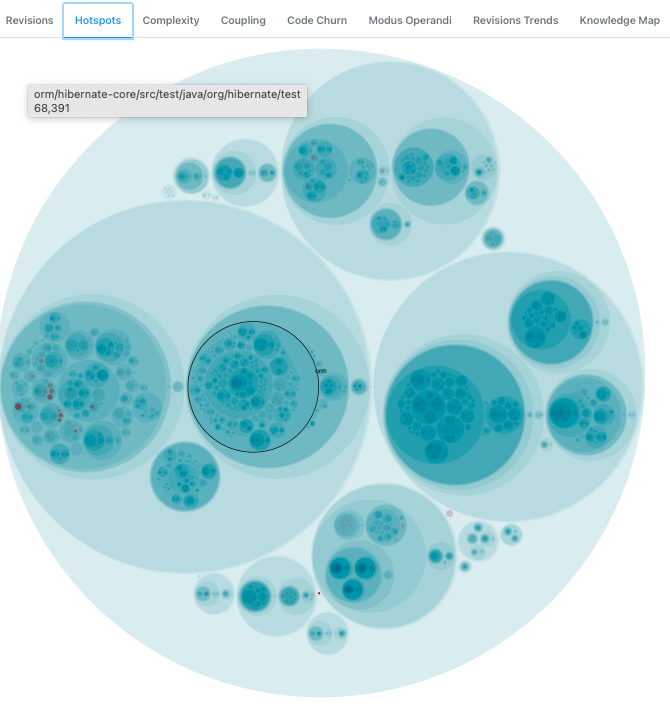

# Introduction

`gocan` is a little side project heavily inspired from the excellent book [Your Code as a Crime Scene](https://pragprog.com/titles/atcrime/your-code-as-a-crime-scene/) written by Adam Tornhill.

It provides a cli to build some of the charts described in that book and that can be used to start conversations regarding the design or organisation of some application.

It has very similar interface to [code-maat](https://github.com/adamtornhill/code-maat), the tool created by Adam Tornhill. Here are some of the main differences:

- written in golang
- only support git
- use a database to store the information
- include the visualisations

_Note_: to understand the visualisations generated by the tool, it is better to read the book first.

# Installation

For MacOS & Linux users, you can use [homebrew](https://brew.sh) to install the application:

```
brew install fouadh/tap/gocan
```

For other platforms, you will have to build the binary from the source code (see the section below).

There is also a [docker image](https://hub.docker.com/repository/docker/fouadhamdi/gocan) that can be used instead of having to install it locally.

To get the list of available commands:

```
gocan help
```

To get help for a specific command:

```
gocan [command] --help
```

# Using the app

## Start the embedded database

Gocan comes with an embedded database that can be used to store the metrics data. To start it, execute the following
command:

```
gocan start-db
```

## Run the UI

To visualize the different charts, execute the following command that bootstraps an embedded web server:

```
gocan ui
```

## Create a forensics scene

A scene is a collection of applications. Before adding any application, create a scene first. It will allow (not yet
implemented) to compare applications gathered in a same scene. It can be useful to analyze distributed systems for example.

```
gocan create-scene my-scene
```

## Add an application to a scene

Create an application in a scene.

```
gocan create-app my-app -s my-scene
```

## Import an application history

In order to get metrics, it is needed to run this command to import information from a git repository that has been
cloned locally.

```
gocan import-history my-app -s my-scene --after 2021-01-01 --before 2021-06-30
```

It is recommended to limit the data that you want to analyze to a small period. Like mentionned in the book, having
too many data can skew the results and obscure most recent trends.

## Stop the embedded database

When you're done using the CLI, you can eventually stop the database.

```
gocan stop-db
```

## Using an external database

It is possible to use an external database instead of the embedded one. To configure it, use the following command
with the appropriate flags values:

```
gocan setup-db --external-db --host dbhost --user dbuser --password dbpassword --port 5433 --database dbname
```

After configuring the database, execute the next command to create the appropriate structure:

```
gocan migrate-db
```

# A First Tutorial

Let's use one of the examples in the book: analyzing Hibernate ORM.

We'll first define a scene and an application, then import its git history.

```
gocan create-scene hibernate
gocan create-app orm -s hibernate
git clone https://github.com/hibernate/hibernate-orm.git
gocan import-history orm -s hibernate --after 2011-01-01 --before 2013-09-04 --directory ./hibernate-orm
```

**Note:** `gocan` does not store the source code in its database, just the statistics about it.

We can then run the UI to see some of the visualisations:

```
gocan ui --port 1234
```

* Open your browser at the appropriate location (here, it will be http://localhost:1234).
* Select the `hibernate` scene
* A short summary of the apps will be displayed
* Select the `orm` application
* The `Revisions` tab will be displayed: it might take a few seconds to display the chart, be patient :-)


You'll notice that there are some date selectors on the page that can be use to specify the analysis range. Those selectors
are present in most of the analyses tabs.

* Select the `Hotspots` tab to visualize the hotspots of hibernate for the considered period. You can zoom-in in the hierarchy by clicking on
the different zones to find more specifically the files suspects.



* Mine the data with the `revisions` command:

This command displays the application files sorted by number of revisions as well as their complexity (in the `code` column).
It is another way to identify the potential suspects.

```
gocan revisions orm -s hibernate
```


We are going to focus on the `Configuration` class that has a big number of lines for a file related to configuration and that also has been revised quite a lot.

Let's analyze the complexity of this file by running the following command:

```
gocan create-complexity-analysis configuration-analysis --app orm --scene hibernate --directory /code/hibernate-orm/ --filename hibernate-core/src/main/java/org/hibernate/cfg/Configuration.java --spaces 4 
```

The `directory` argument specifies the local folder where the git repo can be found and the `filename` argument specified the location of the file to analyze relative to that directory.

The command will return the complexity calculated of that file for the specified time period.

**Note:** to execute that command, you will need to have access to the source code again.


We can see here that there is a maximum number of 14 indentations in some line(s) which might indicated some complicated code there.

Now, if you go to the `Complexity` tab in the UI, you should be able to select the analysis we have just created and named `configuration-analysis`.


We can see how the complexity increased with time.

# A Second Tutorial

Let's use another example from the book: [Craft.Net](https://github.com/ddevault/Craft.Net). This project is not maintained
anymore so we'll have to specify appropriate dates in our commands.

Let's create the app.

```
gocan create-scene craft
gocan create-app craft -s craft
git clone https://github.com/SirCmpwn/Craft.Net.git craft
```

We are importing two periods of the application code that we want to compare:

```
cd craft
gocan import-history craft -s craft --after 2012-07-01 --before 2013-01-01
gocan import-history craft -s craft --after 2013-01-01 --before 2014-08-08
```

For each of the imported period, a complexity analysis is performed.

Let's get a sum of coupling analysis:

```
gocan soc craft -s craft
```

We are going to focus on the `MinecraftServer` file during two periods of time: before and after 2013-01-01.

Let's open the `Entity Coupling` tab and enter the following information:

* in `Entity` field: `Craft.Net.Server/MinecraftServer.cs`
* in `Min Date` field: `2012-06-30`
* in `Max Date` field: `2013-01-01`

And click on `Submit`. You should visualize the following figure:


# Building the app

## Requirements

* golang 1.17
* nodejs
* yarn

## Build

Build a version of gocan. The binary will be generated in the `bin` folder.

```
make build
```

## Test

Run all the tests of the project.

```
make test
```

## Release

Build a release version of gocan for MacOS & Linux OSes.

```
make release
```

gocan was an opportunity for me to learn the Go language so don't be too harsh with the source code :-)

# Troubleshooting

## Stopping the database

You might have some issue with the database when trying to start it after having being stopped.

You would get a message similar to that one:

```
Starting the embedded database...

FAILED
Cannot start the database: process already listening on port 5432
```

For some reason, stopping the database didn't work well, you will have to manually kill it
first and start it after.

The MacOS command to retrieve the process to kill is:

```
lsof -i tcp:5432
```


## Fail to import the history

If for some reason, the history import failed and when you run the command again, it complains
about some database key issue, the simplest action to do is to delete the application and
reimport the history.